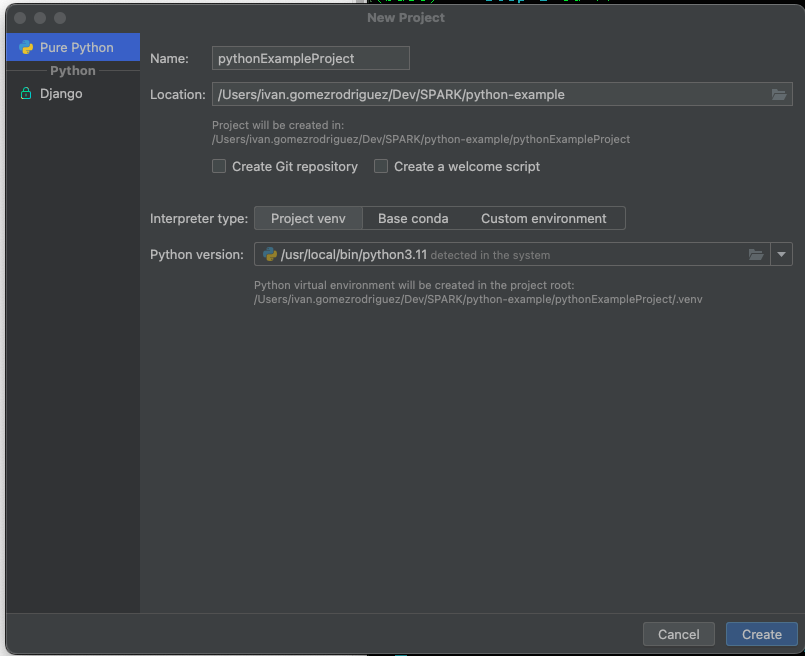

# STEP 1 - Crear un script sencillo que use pyspark

- Creamos un proyecto en pycharm



- Creamos un fichero main.py con el siguiente contenido:

```python
from pyspark.sql import SparkSession

# Create a SparkSession
spark = SparkSession.builder \
    .appName("Example App") \
    .getOrCreate()

# Read CSV file into DataFrame
df = spark.read.csv("data/concellos.csv", header=True, inferSchema=True)

# Show the first few rows of the DataFrame
df.show()

# Stop the SparkSession
spark.stop()
```

- El IDE nos mostrara un error porque no hemos instalado `pyspark`
  - Opción 1 - Instalar con con pycharm
  - Opción 2 - Instalar manualemnte. En el terminal: `pip install pyspark`
  - Crear fichero requirements.txt: `pip freeze > requirements.txt`

- Ejecutar el script:

```bash
python main.py
```